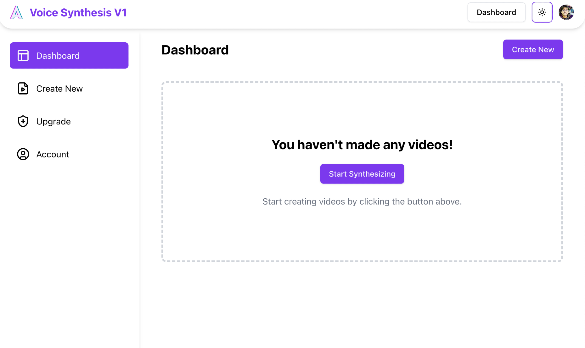

Creating a portfolio isn’t just about showing off projects—it’s about telling a story. I wanted my blog to capture both technical depth and creative energy, so I experimented with a static site setup that allows me to upload markdown files with images in the same directory.

Here’s how I structured my first post.

---

## Why Static Site Generation (SSG)?

Static site generation (SSG) makes the blog blazing fast and secure. Instead of relying on a backend to fetch content on every request, the site pre-renders everything at build time. That means near-instant load times and easier hosting.



---

## Writing in Markdown

Markdown is lightweight and easy to write. Here’s an example of how I include code snippets:

```js
console.log("Hello Blog!");
```

And here’s how I add images (just drop them in the same folder):


---

## Attaching Images

To keep everything simple, I just keep my `.md` file and related images in the same directory. That way, when I commit to GitHub or deploy to my server, all the assets come together.

Example folder structure:

```
/blogs/example/
 ├── main.md
 ├── screenshot.png
 └── ssg-diagram.png
```

---

## Final Thoughts

This first blog post is a starting point. As I continue, I’ll expand into tutorials, behind-the-scenes looks at my projects, and write-ups on experiments I run with AI, design, and startups.

Stay tuned!
